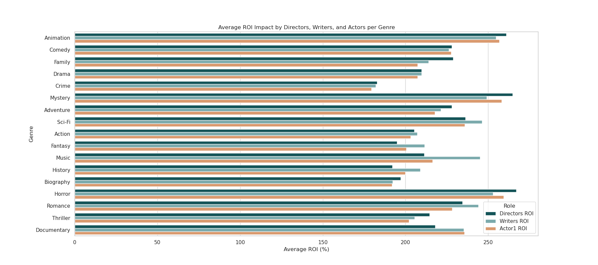

# Box Office Boom
#### Authors: Chisum Lindauer and James Warsing

## Overview
Our company now sees all the big companies creating original video content and they want to get in on the fun. The company has decided to create a new movie studio, but they don’t know anything about creating movies. We are charged with exploring what types of films are currently doing the best at the box office. You must then translate those findings into actionable insights that the head of our company's new movie studio can use to help decide what type of films to create.

## Real-World Problem
The problem your company faces is understanding what makes a movie successful at the box office. With the significant investments required for movie production, making informed decisions is crucial to ensure profitability and return on investment (ROI).

## Stakeholders
The primary stakeholders for this project are the executives and decision-makers in your company's new movie studio. They need insights into current market trends, audience preferences, and financial metrics to guide their investments in movie projects.

## Business Understanding
__Goal:__ Recommend at least 3 actionable insights

### Business Questions
This project will address the following key questions to provide actionable insights:
1. How do the number of reviews affect profit and ROI?
2. What is the impact of average review scores on financial success?
3. How does the budget influence a movie's profitability and ROI?
4. Does the start year of the movie affect its financial performance?
5. Which genres are most associated with high profits and ROI?
6. How do the roles of director, lead actor, or writer within specific genres impact success?

## Data Understanding and Analysis
- Source of Data:
    1. IMDb
    2. Box Office Mojo
    3. The Numbers
    4. API's(The Movie Database, RapidAPI's Movies Database)
- Description of Data: The data we analyzed from various sources identify factors for box office success, including genres, budget, profit, gross, runtime, ratings, and reviews. These features allow us to target and identify specific variables so we can make educated conclusions.

### Visualizations
1. Analyzing vs. ROI

This heatmap lets us see how much each statistic affects the ROI and profit.

2. Top Profit Movies

This shows us the ten movies that have made the most profit.

3. ROI by Genre and Budget

This shows us the budget ranges for each genre and how much ROI they have. This lets us gauge which budget range/genre makes more sense to pursue.

4. Reviews

This chart shows the number of reviews and how they affect the profit.

5. Role Impact by Genre

This chart shows how different filmmaking roles have more or less impact in every genre.

# Final Conclusions

We define success as profit and return on investment.
We sought to answer how ROI affects these factors: Reviews and score, budget, start year, genre, and the impact on ROI of directors, actors and writers.

## Number of Reviews and Review Scores
High engagement is a strong indicator of profitability. It could also indicate more people seeing the movie. Non predictive alone.

## Good Reviews
A higher review score significantly impacts profit and ROI. Ensure the movie is of high quality to enhance box office success.  Non predictive alone.

## Budget, Genre and Role
Bigger budgets mean more risk but more reward.  Starting out with smaller risk and good ROI is a winning break in strategy.  

| Genre                     | Budget      | Budget Range      | ROI Impact |
|---------------------------|-------------|-------------------|------------|
| Romance                   | Low Budget  | Less than $2M     | Writer      |
| Horror                    | Mid Budget  | $2M - $15M        | Director      |
| Animation                 | Mid Budget  | $8M - $82M        | Director     |
| Action, Adventure, Sci-Fi | High Budget | In the Future     |            |

## Start Year
There is no time like the present as ROI decreases for movies as time goes on.

By focusing on these strategies, we can maximize our chances of success and tell more impactful stories that resonate with audiences.

# Implications for Stakeholders
Based on these findings, we recommend that the new movie studio:
- **Focus on High Engagement**: Invest in marketing strategies that drive high audience engagement and reviews.
- **Prioritize Quality**: Ensure high production quality to achieve better average review scores.
- **Strategic Budget Allocation**: Allocate budgets strategically to balance potential returns with investment risks.
- **Target Recent Trends**: Stay updated with recent market trends and audience preferences.
- **Genre Selection**: Start with lower-risk genres like horror or comedy and gradually move to higher-budget genres like action and adventure as the studio gains more experience.
- **Leverage Key Talent**: Invest in good directors, actors, and writers, and realize different roles have more leverage in different genres.

These strategies should help the new movie studio maximize its chances of producing successful and profitable movies.

## For More Information
See the full analysis in the [Jupyter Notebook](https://github.com/james-warsing/Movie-Data-Analysis/blob/main/index.ipynb) or review this [presentation](https://github.com/james-warsing/Movie-Data-Analysis/blob/main/Movie%20analysis.pdf)

For additional info, contact [Chisum Lindauer](https://www.linkedin.com/in/chisum-lindauer-2632112/) or [James Warsing](https://www.linkedin.com/in/james-warsing-a51360303/)