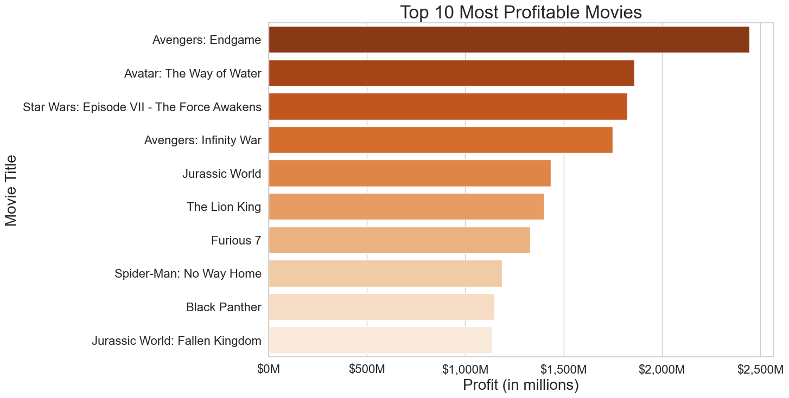

# Box Office Boom
#### Authors: Chisum Lindauer and James Warsing

## Overview
Our company now sees all the big companies creating original video content and they want to get in on the fun. The company has decided to create a new movie studio, but they don’t know anything about creating movies. We are charged with exploring what types of films are currently doing the best at the box office. You must then translate those findings into actionable insights that the head of our company's new movie studio can use to help decide what type of films to create.

## Business Understanding
- __Goal:__ Recommend at least 3 actionable insights
- __Stakeholders:__ Head of the company's new movie studio division
- __Key Business Questions:__ 
    1. What are the factors that correlate to a successful movie?
    2. What is the most profitable genre?
    3. How much investment is worth it to make a profit?

## Data Understanding and Analysis
- Source of Data:
    1. IMDb
    2. Box Office Mojo
    3. The Numbers
    4. API's(The Movie Database, RapidAPI's Movies Database)
- Description of Data: The data we analyzed from various sources identify factors for box office success, including genres, budget, profit, gross, runtime, ratings, and reviews. These features allow us to target and identify specific variables so we can make educated conclusions.
### Visualizations
1. Analyzing vs. ROI

This heatmap lets us see how much each statistic affects the ROI and profit.

2. Top Profit Movies

This shows us the ten movies that have made the most profit

3. ROI by Genre and Budget

This shows us the budget ranges for each genre and how much ROI they have. This lets us gauge which budget range/genre makes more sense to pursue.

4. Reviews

This chart shows the number of reviews and how they affect the profit

# Final Conclusions
We define success as making a profit and having a high return on investment. With our data we were able to compare different features and quantify them so we could make exceptional judgments to guide the head of our company.

To summarize our conclusions:

1. __Number of Reviews:__ High engagement is a strong indicator of profitability. It could also indicate more people seeing the movie. Non predictive alone.

2. __Good Reviews:__ A higher review score significantly impacts profit and ROI. Ensure the movie is of high quality to enhance box office success.  Non predictive alone.

3. __Budget, Genre and Role:__ Bigger budgets mean more risk but more reward.  Starting out with smaller risk and good ROI is a winning break in strategy.  

4. __Start Year:__ There is no time like the present as ROI decreases for movies as time goes on.

## Next Steps
There are still other components we could dive deeper into when it comes to the box office. To venture further into our analysis we would suggest the following:

1. Number of reviews and review scores can’t predict.  We need the full reviews and analyze their contents.  Find out what predicts more reviews and better review scores.  Then use that as predictive parameters.

2. How do we get “butts in seats”?  Analyze data on marketing, promotions, trends, popular ideas, strong IPs, trailer reception and more.

3. Further understand actor, writer and director impact.  Build a model to predict good actors, directors and more for our projects.  Explore top directors, actors, writers and more.

4. Get more and better data, our data set was limited to under 3000 movies.  IMDb and The Numbers both have amazing data, but come with big prices.  IMDb’s is $400,000 a year!

5. Use all analysis to build predictive models.  Use it to predict the success of movie pitches!

## For More Information
See the full analysis in the [Jupyter Notebook](https://github.com/james-warsing/Movie-Data-Analysis/blob/main/index.ipynb) or review this [presentation](https://github.com/james-warsing/Movie-Data-Analysis/blob/main/Movie%20analysis.pdf)

For additional info, contact [Chisum Lindauer](https://www.linkedin.com/in/chisum-lindauer-2632112/) or [James Warsing](https://www.linkedin.com/in/james-warsing-a51360303/)